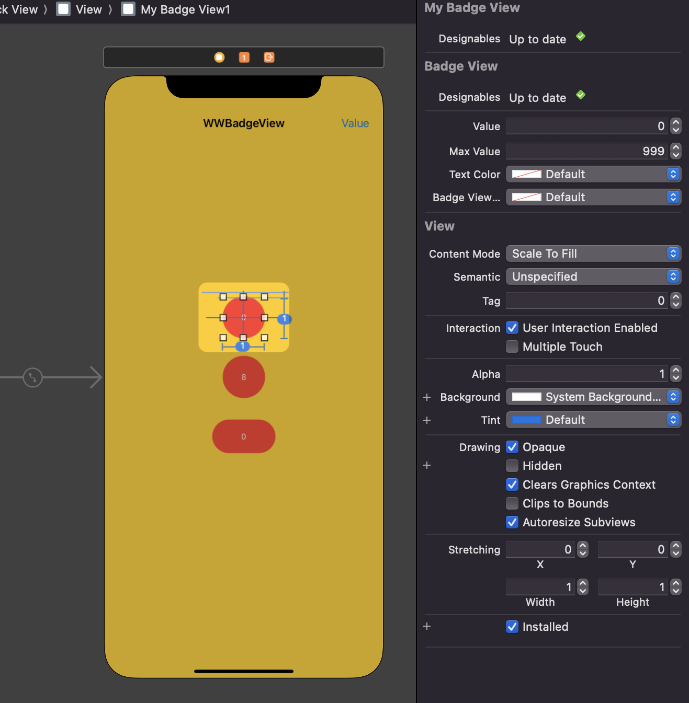

# WWBadgeView
[](https://developer.apple.com/swift/) [](https://developer.apple.com/swift/)  [](https://developer.apple.com/swift/) [](https://developer.apple.com/swift/)

## [Introduction - 簡介](https://swiftpackageindex.com/William-Weng)
- [A simple badge controller that can simply display the numbers on the badge.](https://developer.apple.com/documentation/uikit/uiapplication/1622918-applicationiconbadgenumber)
- [將NSCache功能變的更簡單使用。](https://developer.apple.com/documentation/usernotifications/unusernotificationcenter/setbadgecount&lt;_:withcompletionhandler:&gt;)




### [Installation with Swift Package Manager](https://medium.com/彼得潘的-swift-ios-app-開發問題解答集/使用-spm-安裝第三方套件-xcode-11-新功能-2c4ffcf85b4b)
```js
dependencies: [
    .package(url: "https://github.com/William-Weng/WWBadgeView.git", .upToNextMajor(from: "1.0.0"))
]
```

### [Function - 可用函式](https://platform.openai.com/)
|函式|功能|
|-|-|
|value(_:maxValue:textColor:font)|設定數值|
|border(width:color:)|設定外框|
|background(_:radius:)|設定背景|

### Example - 範例
```swift
import UIKit
import WWBadgeView

final class MyBadgeView: WWBadgeView {}

final class ViewController: UIViewController {
    
    @IBOutlet weak var myBadgeView1: MyBadgeView!
    @IBOutlet weak var myBadgeView2: MyBadgeView!
    @IBOutlet weak var myBadgeView3: MyBadgeView!

    private var value3 = 995
    
    override func viewDidLoad() {
        super.viewDidLoad()
        initSetting()
    }
    
    @IBAction func valueSetting(_ sender: UIBarButtonItem) {
        value3 += 1
        myBadgeView3.value(value3)
    }
}

private extension ViewController {
    
    func initSetting() {
        
        myBadgeView2.value(100, textColor: .black)
        myBadgeView2.border(width: 8, color: .systemBlue)
        myBadgeView2.background(.yellow, radius: 8)
        
        myBadgeView3.value(value3, maxValue: 999, font: .systemFont(ofSize: 20))
        myBadgeView3.border(width: 8, color: .green)
    }
}
```
